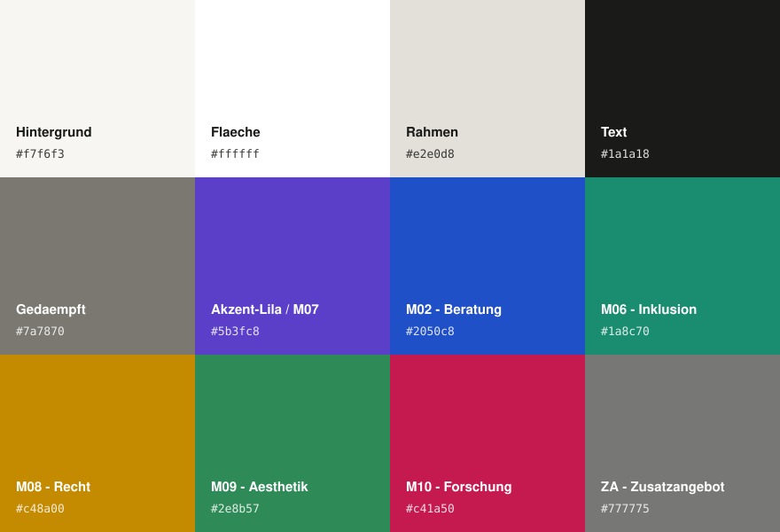

# Vorlesungskalender

Privater, passwortgeschützter Vorlesungskalender für das Studium (Bachelor Soziale Arbeit, 2. Fachsemester) – als einzelne, selbstständige HTML-Seite, gehostet über GitHub Pages.

🔗 **Live:** http://kalender.xn--peppermita-lnb.de/ (eigene Domain) – weiterhin auch erreichbar über https://peppermieta.github.io/Kalender/

## Funktionen

- **Monatsansicht** mit Navigation über Pfeile, Tastatur (←/→), Wisch­geste auf Touch-Geräten oder direktem Sprung zum aktuellen Monat über den "Heute"-Button
- **Farbcodierung nach Modul** – jede Veranstaltung ist ihrem Modul farblich zugeordnet, Legende oben auf der Seite (sortiert M02 → M10, Zusatzangebot am Ende)
- **Mobile Ansicht** – unter 700px Breite wechselt die Seite automatisch von der 7-Spalten-Rasteransicht zu einer einspaltigen Tagesliste, damit Termine nicht abgeschnitten werden; Modulkürzel werden dort direkt am Termin angezeigt
- **Termin-Details per Klick/Tap** – Datum, Uhrzeit, Raum, Modul, LV-Nummer und Parallelgruppe
- **Private Notizen** – pro Termin, rein lokal im Browser gespeichert (kein Sync, kein Server), z. B. "Buch mitbringen"
- **Installierbare App (PWA)** – auf Android als App installierbar (eigenes Icon, kein Browser-Rahmen), funktioniert dank Service Worker auch ohne Internetverbindung
- **Suche** – Freitextsuche nach Veranstaltung oder Modulname direkt im Header; Klick auf ein Ergebnis springt zum passenden Monat und öffnet die Detailansicht
- **Kalender-Abo (ICS)** – Termine lassen sich per `webcal://`-Link in Google/Apple/Outlook-Kalender abonnieren, inkl. automatischer Aktualisierung bei Änderungen (siehe Abschnitt "Kalender-Abo" unten)
- **Modulverzeichnis** – seit Version 2.1.0 ein eigenständiges, öffentlich mit anderen Studierenden geteiltes Projekt: [module.xn--peppermita-lnb.de](https://module.xn--peppermita-lnb.de/) (eigenes Repo: [peppermieta/Modulverzeichnis](https://github.com/peppermieta/Modulverzeichnis)), verlinkt aus dem Kalender-Header. Alle 28 Module, Semesterauswahl, Farben nach Studienbereich, Modulverantwortliche, Workload-Aufteilung, Verwendbarkeit in anderen Studiengängen. Frei zugänglich, ohne Passwortschutz.
- **Passwortschutz** – rein clientseitig (SHA-256-Hash im Quellcode), reicht aus, um die Seite vor Suchmaschinen/Zufallsbesucher:innen zu verbergen, ist aber **kein** echter Sicherheitsmechanismus
- **Anonymisiert** – keine Angaben zu Name, Matrikelnummer oder Hochschule im Code

## Raumnummern pflegen

Räume werden zentral über die `ROOMS`-Zuordnung im `<script>`-Teil der `index.html` gepflegt (Suche nach `const ROOMS`). Eintrag pro **LV-Nummer**, gilt dann automatisch für alle Termine dieser Veranstaltung:

```javascript
const ROOMS = {
  "1-1-0021-1-12357-206206620209731": "Raum 2.14",
};
```

Einzelne Termine lassen sich bei Bedarf mit einem eigenen `raum:`-Feld direkt im jeweiligen `EVENTS`-Eintrag überschreiben (z. B. bei einem Raumwechsel für einen einzelnen Termin).

Solange kein Raum hinterlegt ist, zeigt die Detailansicht "wird noch bekannt gegeben" an.

## Aktualisieren

Die Seite besteht aus einer einzigen Datei (`index.html`), die bei Änderungen ersetzt und auf den `main`-Branch gepusht wird. GitHub Pages baut die Seite danach automatisch neu (meist innerhalb von 1–2 Minuten).

## Kalender-Abo (ICS)

Über den Button "📅 Kalender abonnieren" (bzw. den kopierbaren Link daneben) lässt sich der Kalender in Google/Apple/Outlook Kalender **abonnieren** statt einmalig zu importieren – neue oder geänderte Termine (z. B. Raumnummern) erscheinen dann automatisch, ohne erneuten manuellen Export.

**Wichtiger Sicherheitshinweis:** Die ICS-Datei liegt technisch bedingt **außerhalb des Passwortschutzes** – Kalender-Apps rufen die Datei automatisch im Hintergrund ab und können dabei kein Passwort eingeben. Einziger Schutz ist der **zufällige, nicht erratbare Dateiname** (`feed-<zufälliger-hex-code>.ics`). Diesen Link daher nicht öffentlich teilen.

**Aktualisieren:** Bei Änderungen an den Terminen (z. B. neue Raumnummern) die ICS-Datei neu generieren:

```
node scripts/generate-ics.js
```

Das Skript liest die Termine direkt aus `index.html` aus – es gibt also nur eine einzige Datenquelle. Der Dateiname bleibt dabei automatisch gleich (fest im Skript hinterlegt), damit bestehende Abos nicht brechen.

## Modulverzeichnis ausgelagert

Das Modulverzeichnis lebt seit Version 2.1.0 nicht mehr in diesem Repo, sondern als eigenständiges,
öffentlich geteiltes Projekt unter [module.xn--peppermita-lnb.de](https://module.xn--peppermita-lnb.de/)
([Repo](https://github.com/peppermieta/Modulverzeichnis)). Die alte `module.html` in diesem Repo
leitet automatisch dorthin weiter. Details zur Migration siehe
[PLANUNG_Modulverzeichnis-v2.md](PLANUNG_Modulverzeichnis-v2.md).

## App-Installation (PWA)

Der Kalender lässt sich auf Android als App installieren:

1. Seite in **Chrome** öffnen: http://kalender.xn--peppermita-lnb.de/
2. Menü (⋮) → **"App installieren"** bzw. **"Zum Startbildschirm hinzufügen"**

Danach startet der Kalender wie eine normale App (eigenes Icon, kein Browser-Rahmen) und funktioniert dank Service Worker auch **ohne Internetverbindung** – zuletzt geladene Termine, Suche, Modulverzeichnis etc. bleiben offline nutzbar.

**Wichtig bei Code-Änderungen:** Der Service Worker (`sw.js`) lädt HTML-Seiten "network-first" (bei bestehender Verbindung immer die neueste Version), damit Updates nicht durch veraltete Caches verzögert werden. Trotzdem bei jeder inhaltlichen Änderung `CACHE_VERSION` in `sw.js` erhöhen – das räumt alte Caches sauber auf.

## Versionshistorie

Alle Änderungen werden in [CHANGELOG.md](CHANGELOG.md) dokumentiert (aktuelle Version: **2.2.0**).

## Farbpalette



Vollständige Werte (Hex, RGB, CMYK, HSB, HSL, Lab) in [PALETTE.md](PALETTE.md).

## Tech-Stack

Reines HTML/CSS/JavaScript, keine Frameworks oder Build-Schritte. Schriftart: [Inter](https://fonts.google.com/specimen/Inter) & [JetBrains Mono](https://fonts.google.com/specimen/JetBrains+Mono) über Google Fonts.
